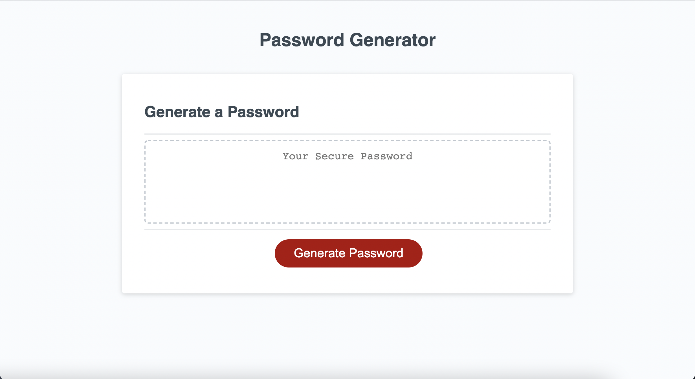
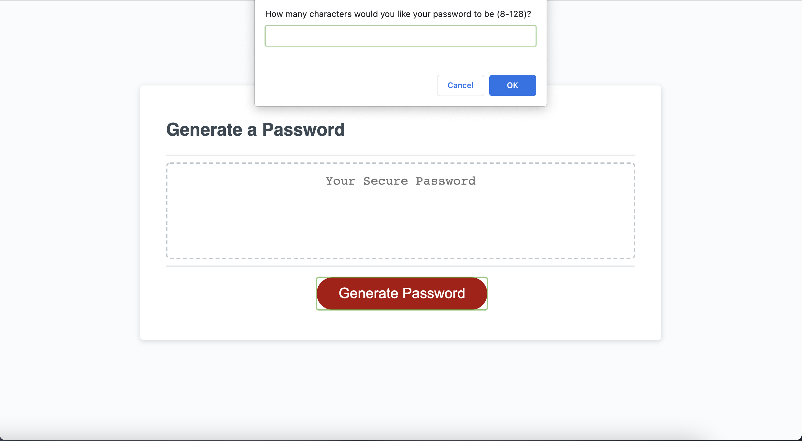
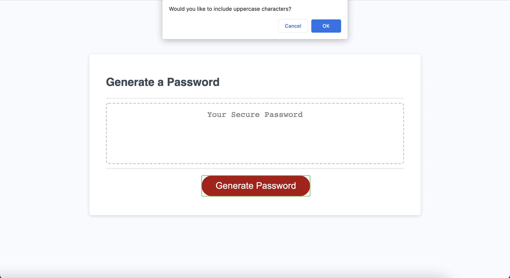
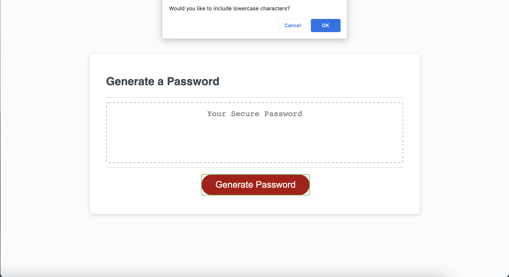
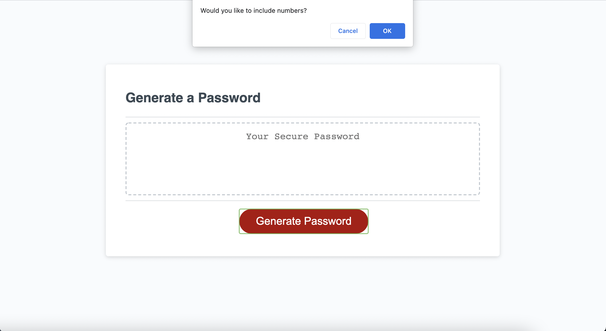
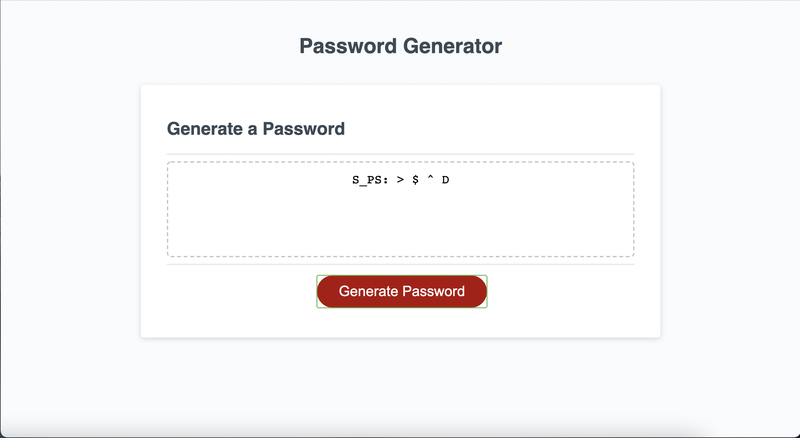

# Random password generator using Javasccript

## Summary 

This application enables users to generate random passwords based on criteria that they've selected including lowercase and uppercase letters, numbers and special characters. The application presents a clean and visually engaging design using HTML and CSS powered by JavaScript. The users can choose between 8 to 128 characters and generate random passwords which will secure their data and privacy. Further information about the code is commented on the script. 

**Screenshots of the website**

**Link to deployed application**

Here is the access to the complete application : https://hzzrin.github.io/password_generator/Work%20file/index.html 